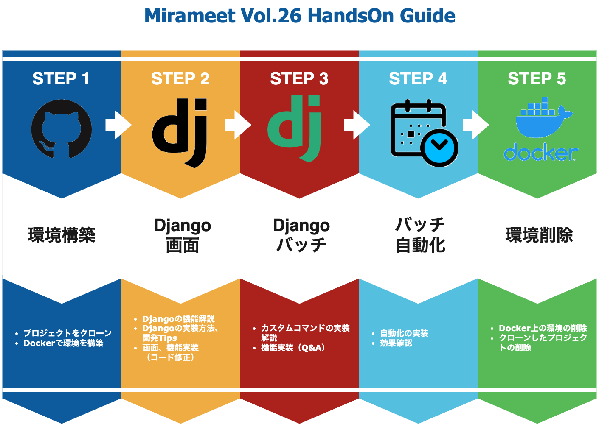

# Python×Djangoの実践スキルを学ぼう！～CSVデータの自動取込をやってみよう！～​

## 事前準備
- VSCodeインストール
- Dockerインストール
- Gitインストール、GitHubアカウントの作成

## 今回の流れ（登録画面の実装 ～ バッチ処理の自動化）
Djangoフレームワークを用いて、登録処理を行うことの出来る画面を作成。その後、バッチファイルを作成しcsvファイルデータを自動的にDBへ取り込むところまで実施します。
  

## 手順
全体手順としては以下の流れで進めます。

- デモアプリクローン
- デモアプリの起動・動作確認
- アプリケーションコード修正
- バッチファイルコード修正
- バッチファイルの動作確認
- バッチ処理の自動化
- 後片付け
