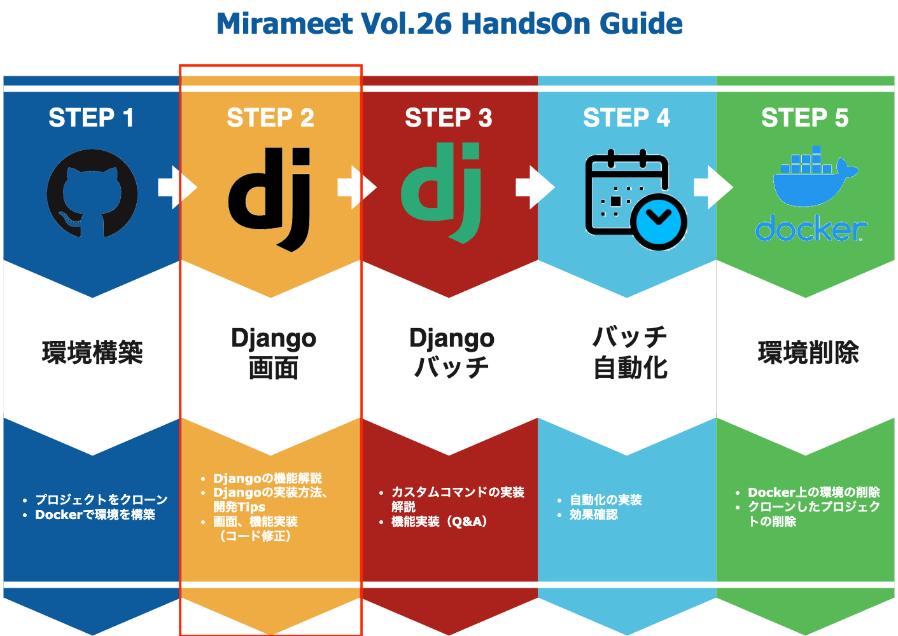
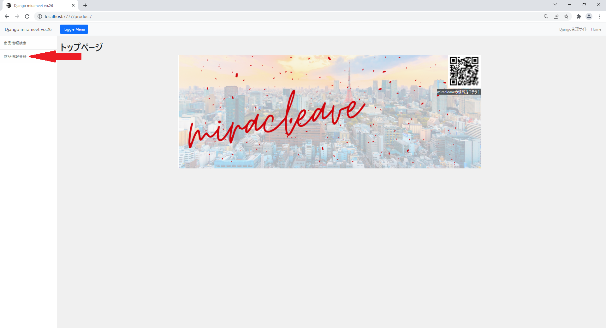
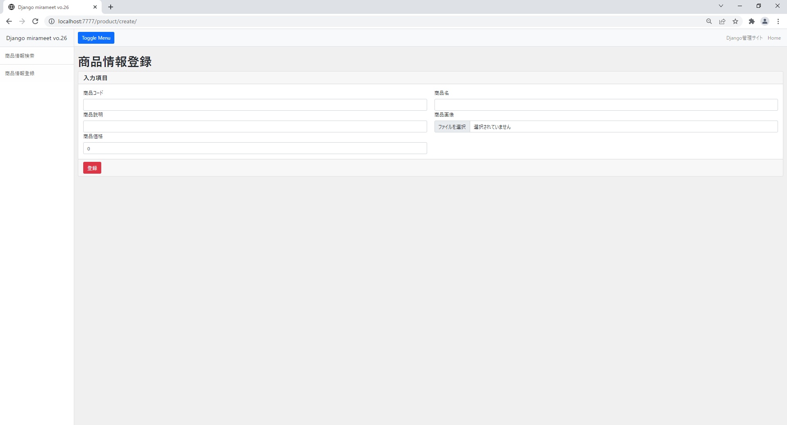

# アプリケーションコード修正（商品情報登録画面）
当手順では以下赤枠部分の商品登録画面のコードを修正していきます。



## 当画面に関連するソースファイル

- app\product\views\product_create_view.py **←修正対象**
- app\product\urls.py **←修正対象**
- templates\product\product_create.html


修正する前に一度、状況を確認してみましょう。

http://localhost:7777

登録画面、機能が実装できていないことが確認できたかと思います。

確認できたところで、あらためて修正をすすめていきましょう！

## Viewの修正
画面からボタンを押下した際に、画面に入力した値をDBへ登録する処理を実装します。

>app\product\views\product_create_view.py

```python
from app.product.forms.product_create_forms import ProductCreateForm
from app.product.models.product import Product
from django.urls import reverse_lazy
from django.views.generic import CreateView


class CreateProductView(CreateView):
    model = Product
    form_class = ProductCreateForm
    template_name = 'product/product_create.html'
    success_url = reverse_lazy('product:product_create')
```


## urls.pyの修正

app\product\urls.py に登録画面用のviewをインポートし、

urlpatternsに登録画面へ遷移する為のURL文字列とインポートしたviewを設定します。
>app\product\urls.py

変更前

```python
from django.urls import path
from app.product.views.product_update_view import ProductUpdateView

    ・・・

    path('create/', TemplateView.as_view(template_name='product/product_create.html'), name='product_create'),
```

変更後

```python
from django.urls import path
from app.product.views.product_create_view import CreateProductView
# 以下importを追加
from app.product.views.product_update_view import ProductUpdateView

・・・
    # 元の文と差し替え
    path('create/', CreateProductView.as_view(), name='product_create'),
```

- ポイント

  WEBサイトの多くは

  - DBからの情報を絞り込んで検索結果を表示する
  - 検索結果の内、単一の情報の詳細内容を表示する
  - 画面に入力された内容を元にDBへ情報を登録・更新する
  
  という機能を持っています。
  
  上記のような定型的な処理について、同じようなコードを書かなくても済むようあらかじめDjangoに処理が定義されています。
  
  その処理のことを汎用ビューと呼び、関数で定義されていれば「関数ベース汎用ビュー」、クラスで定義されていれば「クラスベース汎用ビュー」と呼びます。

  クラスベース汎用ビューの内、何点かピックアップして紹介します。
  
- DetailView

    個別詳細ページ実装時に使用する汎用ビューとなります。
    modelに定義されたテーブルより、URLに指定されたプライマリーキーを元に絞り込まれたレコードを1件取得します。
    
    ※今回配布させて頂いている資材のapp\product\views\product_detail_view.py がDetailViewを使用している画面となりますので、併せてご確認ください

<実装例>

> views.py

```python
    from django.views.generic import DetailView
    from mymodel.model import MyModel


    class MyDetailView(DetailView):
        model = MyModel
```

> urls.py

```python
    urlpatterns = [
        path('<int:pk>', MyDetailView.as_view()),
    ]
```
  
  - CreateView／UpdateView
  
    CreateViewは、新たにレコード追加するフォームを定義することが出来るビューとなります。

    UpdateViewは、すでに存在するデータを更新するフォームを定義することが出来るビューとなります。

    ```form_valid``` , ```form_invalid```というメソッドが定義されているので、エラーの有無によって独自の処理を実施することが可能です。

    ※今回配布させて頂いている資材のapp\product\views\product_update_view.py がUpdateViewを使用している画面となりますので、併せてご確認ください


<CreateViewの実装例>

> views.py

```python
from django.views.generic import CreateView
from mymodel.model import MyModel
from forms import MyModelForm

class MyCreateView(CreateView):
    model = MyModel
    form_class = MyModelForm

    def form_valid(self, form):
        ''' 入力内容チェックにエラーがない場合 '''
        messages.success(self.request, "保存しました")
        return super().form_valid(form)

    def form_invalid(self, form):
        ''' 入力内容チェックにエラーがある場合 '''
        message.warning(self.request, "保存できませんでした")
        return super().form_invalid(form)
```

> forms.py

```python
from django import forms
from mymodel.model import MyModel


class MyModelForm(forms.ModelForm):

    class Meta:
        model = MyModel
        exclude = ['create_at', 'update_at', 'create_user', 'update_user',]
```

> urls.py

```python
urlpatterns = [
    path('create/', MyCreateView.as_view()),
]
```


## 画面確認
以下URLをブラウザにて入力し画面を表示します。

http://localhost:7777

商品登録情報ボタンを押下してみてください。



登録画面が表示されレイアウトがイメージの通り変更されていれば成功です。このままデータの登録もしてみましょう。



無事登録出来たら、このまま管理画面（Django管理サイト）に移動して実際に登録されているかも併せて見てみましょう。

このとき、usernameとpasswordを求められますが、これは先程createsuperuserで設定したusernameとpasswordでログインすることが出来ます。
