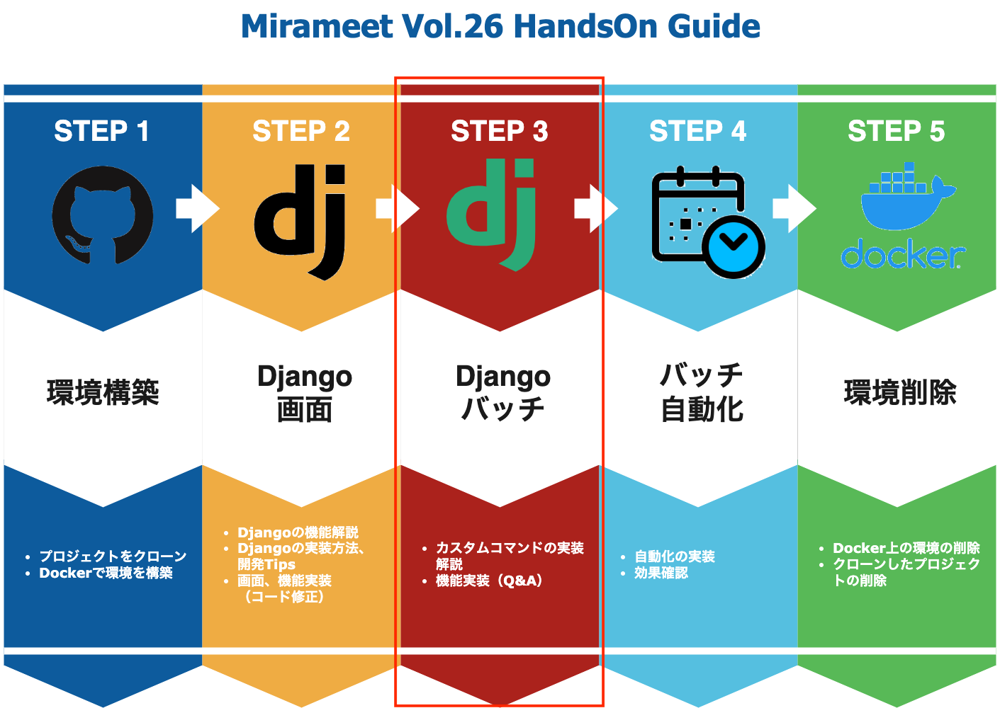

# カスタムコマンド（CustomCommands）

当手順では以下の赤枠部分を実施します。カスタムコマンドについてご説明致します。



ここでは、カスタムコマンド（CustomCommands）の実装方法、オプションとして引数を与える場合の記述例などを一通りお話しさせていただいた後、
次のセクションで、未実装となっている以下のバッチファイルのソースコードを修正しつつ、簡単な選択問題に答えていただいて実装していただければと思います。

- /meetup/app/batch/management/commands/product_data.py
- /meetup/app/batch/batches/product_import.py

問題については回答も用意しておりますので、ぜひトライしてみましょう！

## CustomCommandsの実装方法
カスタムコマンドは標準でDjangoが持っている機能なので、特別なライブラリをインストールする必要などはありません。

通常のアプリケーションを作成する手順通りコマンドを実行しますが、今回はすでにbatchアプリが作成されているため、そこに新たにbatchファイルを作成していきましょう。

```sh
docker-compose exec web touch ./app/batch/management/commands/product_test.py
```

product_test.pyに以下のように記載します
>/meetup/app/batch/management/commands/product_test.py

```python
from django.core.management.base import BaseCommand


class Command(BaseCommand):

    def handle(self, *args, **options):
        print("batch test")
```

これでバッチが動く状態となります。
以下のコマンドを実施してみましょう。
```sh
docker-compose exec web python manage.py product_test
```

実行することで以下のように出力されます。
```
batch test
```

では、実際にバッチを動かせたところで、カスタムコマンドを最低限実装するにあたり,
気をつけるポイントが２つあります。

ひとつは、BaseCommandをインポートし、実装するファイル内でBaseCommandを継承した、Commandクラスを定義すること。

もう一つは、定義したクラス内で「handle」という関数を継承させることです。

このhandler関数内に必要な処理を記載することで先程のようにカスタムコマンドを認識し、処理を実行できるようになります。

また、例えば「コマンドへ引数を渡すようにしたい。」というような際は、以下のように

「add_arguments」関数の記載を加えて、「handle」関数側で「options」からそれぞれの値を取り出すことで、コマンドへ引数を渡すことができます。


>/meetup/app/batch/management/commands/product_test.py

```python
from django.core.management.base import BaseCommand


class Command(BaseCommand):

    def add_arguments(self, parser):
        parser.add_argument('-a', '--appname', required=True, type=str)
        parser.add_argument('-d', '--description', required=True, type=str)        

    def handle(self, *args, **options):
        appname = options['appname']
        description = options['description']
        print(f'appname={appname} , description={description}')
```

こちらの実装内容ですと、引数「appname」と「description」を必須指定としており、実行する際は以下のように入力する必要があります。

```sh
docker-compose exec web python manage.py product_test --appname batch --description producttest
```

実行することで以下のように出力されます。
```sh
appname=batch, description=producttest
```

より詳しい内容を知りたい方は公式を参考にしていただければと思います。
>https://docs.djangoproject.com/en/4.0/howto/custom-management-commands/

では、次からコード修正と問題の方に移っていきます。