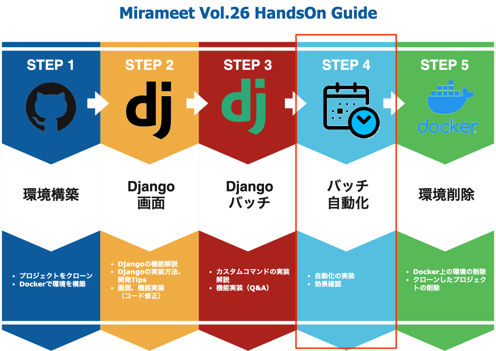

# 自動化処理の実装 -incron-

当手順では以下の赤枠部分のバッチの自動化についてご説明致します。



## 自動化にあたり
バッチを自動で定期的に実行するために、ジョブ管理ツールや運用管理ソフトを導入したり、Linuxではcron、atなどのジョブスケジューラを検討するかと思います。


今回のハンズオンでは、自動化されている様子をすぐに確認していただくために、「incron」を使用したいと思います。

incron　については本ハンズオンから少し外れた領域のため、詳細の説明は割愛させていただきますが、興味のある方はぜひ一度調べてみて下さい。

- incronとは
>"inotify cron"システム。デーモンとテーブルマニピュレーターから構成されており、cronと同じように使用する事が可能。大きな違いとして、cronは期間や日時などのイベントで処理するデーモンに対し、incronはファイルシステムのイベントで処理されます。


## Incronの設定・起動
ここからはコンテナ内で作業する必要があります。以下のコマンドを実行して下さい。
```sh
docker-compose exec web bash
```

コンテナに入れたら、以下のmakeコマンドを実行して下さい。
```sh
make incron-set
```
続けて、以下のコマンドを実行して下さい。
```sh
cd ./csv
service incron start && incrontab -d
```

ここまで実行することで、

**"/meetup/csv/フォルダに"**、**"ファイルが移動されてきたら"**、**"/meetup/sh/product.sh"** を実行し、**"/meetup/logs/batch.log"** というログファイルを出力する設定が完了しました。

makefileに上記設定について記載していますので、makefileを覗いてみましょう。

```
incron-set:
	echo "root" > /etc/incron.allow
	incrontab -l | { cat; echo '/meetup/csv/ IN_MOVED_TO /bin/sh /meetup/sh/product.sh >& /meetup/logs/batch.log'; } | incrontab -
```

>echo "root" > /etc/incron.allow

こちらでは、incron.allowに許可するユーザーを記載しています。
（今回は"root"としていますが、実運用では適切なユーザーを設定して下さい。）

>incrontab -l | { cat; echo '/meetup/csv/...

こちらの内容では「incrontab」へ

- 監視する対象（/meetup/csv/）
- 監視するイベント(IN_MOVED_TO)
- 実行する処理(/bin/sh /meetup/sh/product.sh >& /meetup/logs/batch.log)

以上を入力しています。


それでは、実際に自動でバッチファイルが実行され、DBに登録されるかをみていきたいと思います。

## data.csvの修正
/meetup/csv/data.csvを以下のフォルダに一旦移動させます。
```sh
mv /meetup/csv/data.csv /meetup/taihi/
```

次にdata.csvを修正します。

先程のセクションでバッチを起動しているので、3つのデータが登録されています。

このあとの自動処理後に、反映されたデータがすぐわかるよう、データ数が増えるように修正しましょう。

- 修正前
```
code,name,explanation,price,create_user,update_user
2,orange,mamde in japan,500,999,999
3,computer,mac,5000,999,999
```

- 修正後
```
code,name,explanation,price,create_user,update_user
4,pen,mamde in japan,100,999,999
5,bicycle,mamde in germany,35000,999,999
```

それでは、準備が整いましたので、以下のコマンドを入力して下さい。

```sh
mv /meetup/taihi/data.csv /meetup/csv/
```

移動できたらadmin画面からデータが登録されているか確認してみましょう！
また、ログファイルにも内容が出力されているので、そちらも併せて確認しましょう！
登録されていれば成功です！

http://localhost:7777/admin/product/product/